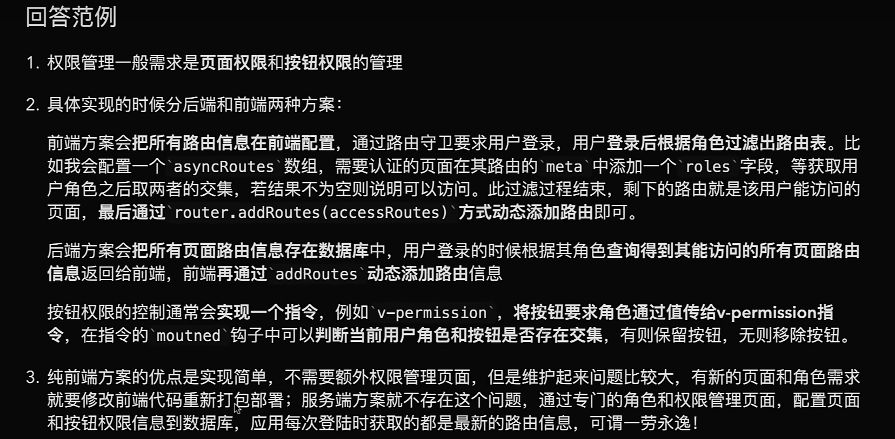
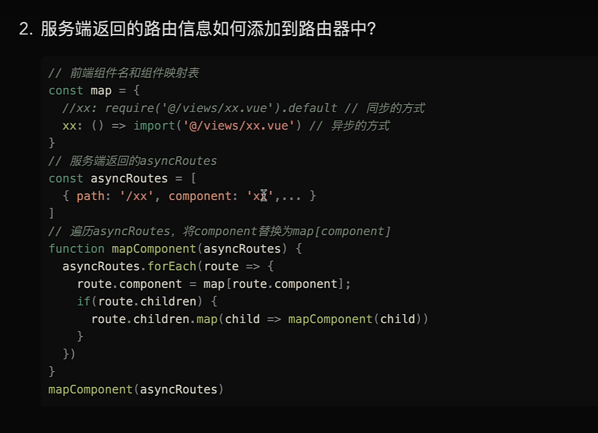
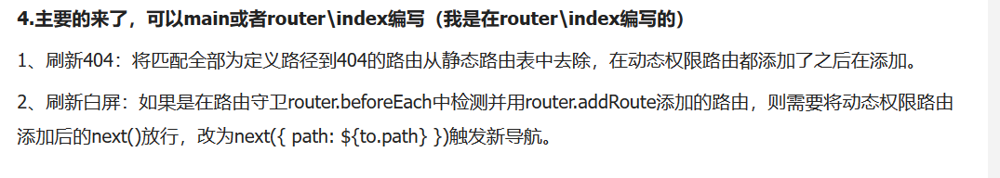

### 介绍

> 这是一个用来练习Vue后台权限管理的简单模板，是我看了一个[B站视频](https://www.bilibili.com/video/BV15Q4y1K79c?t=5306)时，苦于没资料，于是自己花了点时间搭了一个，这里做来分享，分为两版：

* 基础模板：有基本操作，mock等功能了，没实现权限判定；
* 实现模板：基于基础模板做了权限的判定。

### 安装&运行

1. 克隆项目

   `git clone git@github.com:Aizener/admin-permission.git`

   这个直接把基础模板和实现的模板都克隆下来的，develop的是基础模板，master的实现模板。

2. 安装依赖：

   执行：`yarn`或者`yarn install`；

3. 基础模板：

   基础模板在`develop`分支，可以通过`git checkout develop`来切换；

4. 实现模板：

   基础模板在`master`分支， 可以通过`git checkout master`来切换；

5. 启动服务

   `yarn serve`

6. 效果图：

   

### 基本实现

这里说一下这个Demo的实现，通过什么技术，用的哪些知识点完成开发。以及，关于对于权限管理的一些理解与实现，大体分为以下几类：

#### 视图

模板是通过[ElementUI](https://element.eleme.cn/)来搭建的，这个基于的UI组件库非常好用。

#### 数据Mock

数据是通过[mockjs](http://mockjs.com/)来实现的，但是因为这个库好像不能模仿响应状态码，不过用起来还是挺方便的。

#### 请求

请求数据的库，我使用的是[axios](http://www.axios-js.com/)这个库，这个库使用也非常的方便简单。

#### 数据保存

数据的保存通过Vuex和sesstionStorage来实现的。

### 权限判断

基本实现知识完成了一些基本的东西，权限判断的话，前端主要是分为一下四类：

#### 路由级别的判定

通过**beforeEach**全局守卫钩子，来进行token验证，是否能通过路由来登入其他页面；

#### 菜单级别的判定

通过后端返回的`json`菜单权限数据，进行动态渲染，这里通过`router.addRoutes`动态添加菜单，没有的就不会出现了；

#### 元素级别的判定

通过后端返回的`json`操作权限数据，绑定在`router`元信息上，再通过`this.$route.meta`在页面取出对应权限。再通过自定义指令的实现完成禁止、移除等。

#### 请求级别的判定

通过axios的拦截器，判定某个用户在某个页面的操作是否有权限，通过`router.currentRoute`获取元信息来判定。

### 补充（关于代码的一些东西）

用户有两个，一个是普通用户，一个是管理员

- 普通用户用户名就是：普通用户，密码是：normal；
- 管理员用户名就是：管理员，密码是：admin。

权限判定的指令使用：

`v-permission.disabled="condition"` 如果condition为true，则禁用当前绑定指令的标签；

`v-permission.remove="condition"` 如果condition为true，则移除当前绑定指令的标签。

结尾：大体就这些了，接口方面已经写好交互了。

------

### 项目出自上文，下述内容为个人看法。
code - B站上另一种权限管理实现的思路，感觉上不是很清晰，大家学习可以参考下方图片进行面试题答题。

------
1. 定义静态路由，项目首先登录后获取用户信息|权限标识 - 存入 vuex 中，并持久化；
2. 根据后端返回的用户信息，渲染左侧菜单栏，实现**菜单的控制**；
3. 限制路由跳转，通过 beforeEach；
4. 登录成功后，进行动态路由的添加；
- 定义对象映射关系，根据返回的组件名（标识），替换组件映射表；
- 使用 router.addRoutes() 动态添加路由，实现 **界面的控制**；
刷新存在问题：动态路由方法不会执行（登录成功时执行了一次），可以在 App.vue 根组件执行一次
5. 按钮显隐的控制
- 之前动态添加路由时，可以再添加一项路由元信息，存储该路由对应页面的按钮权限信息；
- 注册全局自定义指令，在需要被控制的按钮上使用它，拿取路由上元数据 router.currentRoute.meta 对比数据，删除 dom 或者隐藏；
6. 请求响应的控制
请求拦截器：对非登录请求进行拦截 headers 中添加 token，定义请求方式和行为的映射关系，对当前模块非权限内的请求进行拦截。
响应拦截器：对状态码进行返回错误信息，
7. 动态路由产生的问题
- 添加动态路由后刷新产生 404 或者 白屏？
- 404 是因为在动态路由添加之前，已经在静态路由中。router.addRoutes 不会触发新导航，刷新界面是会路由到404界面；解决办法：在最后动态添加 404 路由；
- 白屏是因为如果实在路由导航守卫中动态添加的路由，则需要将动态添加路由的 next() 改为 next({ path: to.path }) 去触发新导航。
